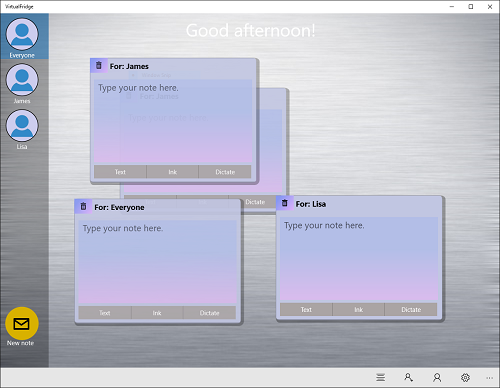
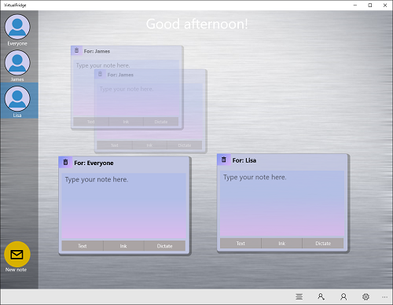

## Facial recognition
A design goal for the FamilyNotes app was that it support ease of use. With that in mind, one of the features that we particularly wanted to add was the ability for the app to recognize the user that was in front of device on which it was running and use that to provide a more relevant experience. As is often the case, what seemed like a simple feature on the surface became more complex as we started to implement the idea. This section discusses our implementation and outlines some of the design factors.

## Privacy considerations
For an app to automatically recognize a user when they stand in front of a device, the app needs to have an awareness of the environment around the device. Knowing first whether a user is present and then, most importantly, who that user is. One way to create that awareness is through the use of the camera and it's video and image capture capabilities combined with facial recognition. However, given the privacy considerations inherent in the automatic capture and analysis of imagery, it is not something to undertake lightly. Apps should not record information silently without providing notice to the user and should always be within the users control.  

In order to enable this functionality for the sample, we opted to inform the user that when they added a profile image to the app it would be submitted to the Azure Face service, as well as allow the user to control the dynamic capture of imagery for facial comparison through enabling or disabling the feature with the press of a button in the [CommandBar](https://msdn.microsoft.com/en-us/library/windows/apps/windows.ui.xaml.controls.commandbar). At the same time that button press launched a warning dialog and, once the feature was enabled, a textbox was displayed calling out that the feature was active. This way the user was always aware when imagery was being submitted to Microsoft services, as well as when the camera was turned on and might be taking pictures of the environment.

Please keep in mind that this app is a sample meant to illustrate features and might not implement all privacy actions that are required for a shipping app. For your app, you should be aware of privacy concerns and take appropriate actions to protect users. For additional requirements related to Microsoft Cognitive Services, see the [Developer Code of Conduct for Cognitive Services](http://research.microsoft.com/en-us/UM/legal/DeveloperCodeofConductforCognitiveServices.htm). For additional information about user privacy requirements for apps, see the [Microsoft Store Policies](https://msdn.microsoft.com/library/windows/apps/dn764944.aspx). 

## Microsoft Cognitive Services
Through the Microsoft Cognitive Services it is possible to perform facial recognition and user identification. Within the context of the FamilyNotes app, this functionality allows for filtering notes down to only those relevant to the user currently viewing the device. As seen below, by default, a user is presented with all notes, not just their own.



To allow the app to automatically filter based on the specific user present, the profile pictures taken when a user account is created are used along with a dynamic image of the user currently in front of the device. The first step in this process is the creation of a `FaceClient`, which requires a subscription key to the Azure Face service and an endpoint URL. The specific call is simply `var _faceClient = new FaceClient(new ApiKeyServiceClientCredentials([subscription key])) { Endpoint = [endpoint] };`.

Once the `FaceClient` is created, it can be used to interact with the assorted Face API as described in the following sections to allow for automatic note filtering. The resulting behavior is seen below. When the user Lisa is detected, notes to other users shrink and become transparent, leaving notes to Lisa and Everyone readily viewable.
   


## Seeding the collection
With a FaceClient created, enabling facial recognition begins with the creation of a collection of user images, which is used to prepare the Azure Face Similarity API for facial recognition.

**Note:** Depending on what API you use for facial recognition, you might need more than one image as the initial information for a user. At this point in time, FamilyNotes uses the Azure Face service from the [Azure Cognitive Services](https://azure.microsoft.com/en-us/services/cognitive-services) and, while more could be used, only needs one image for our scenario.

FamilyNotes enables users to add an image when they are creating a user. Using the Azure Face service, the image is than added to a collection of faces available to Microsoft Cognitive Services. In order to make this as simple as possible from a code perspective, FamilyNotes uses the [CameraCaptureUI](https://msdn.microsoft.com/en-us/library/windows/apps/windows.media.capture.cameracaptureui.aspx). When the user presses the provided button to take a snapshot, the following code calls up the [CameraCaptureUI](https://msdn.microsoft.com/en-us/library/windows/apps/windows.media.capture.cameracaptureui.aspx). 
``` cs
CameraCaptureUI captureUI = new CameraCaptureUI();
captureUI.PhotoSettings.Format = CameraCaptureUIPhotoFormat.Jpeg;
captureUI.PhotoSettings.AllowCropping = false;

StorageFile photo = await captureUI.CaptureFileAsync(CameraCaptureUIMode.Photo);
```
To make the process as quick and simple as possible for users, cropping is disabled. This eliminates the cropping dialog and makes it take one less action to complete the process. Once the user takes a snapshot, it is stored in the *photo* variable. If the user cancels taking a picture, *photo* is set to **null**.

Once the process of adding a user is completed, this temporary file is moved to a permanent location based on the local directory for the app. This work is done in the main thread for the app, which is necessary because the app cannot guarantee whether the user is successfully added until the dialog is closed. At the time the picture is taken, the process can still be aborted. As noted earlier, if a picture is taken it is submitted to the Azure Face service for storage, but a local copy is maintained for a user icon and so that the service FaceList can be rebuilt when needed.
``` cs
// Create a directory for the user (we do this regardless of whether or not there is a profile picture)
StorageFolder userFolder = await ApplicationData.Current.LocalFolder.CreateFolderAsync(("Users\\" + newPerson.FriendlyName), CreationCollisionOption.FailIfExists);

// See if we have a profile photo
if (dialog.TemporaryFile != null)
{
    // Save off the profile photo and delete the temporary file
    await dialog.TemporaryFile.CopyAsync(userFolder, "ProfilePhoto.jpg", NameCollisionOption.ReplaceExisting);
    await dialog.TemporaryFile.DeleteAsync();

    // Update the profile picture for the person
    newPerson.ImageFileName = userFolder.Path + "\\ProfilePhoto.jpg";
    newPerson.IsProfileImage = true;

    if (AppSettings.FaceApiKey != "")
    { 
        await FacialSimilarity.AddTrainingImageAsync(newPerson.FriendlyName, new Uri($"ms-appdata:///local/Users/{newPerson.FriendlyName}/ProfilePhoto.jpg"));
    }
}
```
You'll notice that after the image is locally stored there is a call to the static FacialSimilarity class `AddTrainingImageAsync` method. The FacialSimilarity class is a static class we created that controls interactions with the Microsoft Face Similarity API. The static class is used to help control access to Azure Cognitive Services and keep usage from exceeding free transaction limits. In the case of this particular call, when an image has been captured and user added to the app, the image is in turn added to a Microsoft Face API `FaceList`, which is a persistent list of faces detected from images submitted to the service. This allows faces to be saved in a `FaceList` that was created when the app launched and then referenced later if the user enables facial recognition.


## Capturing user presence and determining identity
Once the initial pictures have been created and stored, FamilyNotes can attempt to run facial recognition to identify the user most likely standing in front of the camera. However, the first step to doing this is to take a temporary image with the camera that can be used to pass off to the Face Similarity API.

There are a lot of considerations for how to run the facial recognition. A primary concern for us was that we did not want to have the app continuously taking pictures as fast as possible and submitting them all of the time for recognition checks. Doing so would have created a lot of unnecessary load on the system, both for the FamilyNotes app and any verification API that it used. To protect against this issue, the user presence code has several rules that it follows about when to take a picture. Specifically, these were the design considerations put into place:
* While FamilyNotes is currently filtering notes for a user, there is no need to take pictures and check for identity. Thus ensuring that the user can manually set the active user regardless of facial recognition.
* If the similarity API fails to identify a user, FamilyNotes waits 10 seconds before taking another picture and attempting to identify a user again.
* A user can reset the timer if they manually select a person and then go back to no filter. The idea behind this decision is that entering the unfiltered state resets the state of facial recognition.
* Currently for simplicity, FamilyNotes only attempts to run facial recognition if it detects a single face. At this point in time, there is no expected behavior if more than one user stands in front of the app at the same time. As such, FamilyNotes does not take pictures and does not attempt to identify users in this case.

Since FamilyNotes takes images in the background, it is not possible to use the [CameraCaptureUI](https://msdn.microsoft.com/en-us/library/windows/apps/windows.media.capture.cameracaptureui.aspx) to take pictures. That user interface requires user interaction to function. However, these pictures should be taken in the background, without the user needing to do anything. To accomplish that, FamilyNotes instead needed to use the [MediaCapture](https://msdn.microsoft.com/en-us/library/windows/apps/windows.media.capture.mediacapture.aspx) class. In order to create and use a [MediaCapture](https://msdn.microsoft.com/en-us/library/windows/apps/windows.media.capture.mediacapture.aspx) object, you need to have access to the [DeviceInformation.Id](https://msdn.microsoft.com/en-us/library/windows/apps/windows.devices.enumeration.deviceinformation.id.aspx) for the device. This can be set through the settings dialog using the [DevicePicker](https://msdn.microsoft.com/library/windows/apps/dn930841). If the user has not specified the device, FamilyNotes attempts to capture the default front camera for the device. In the following code, if the camera device ID is set through the settings dialog, then *IsDefaultCapture* will be **false**.
``` cs
// Create MediaCapture and its settings
_mediaCapture = new MediaCapture();

var Settings = new MediaCaptureInitializationSettings();

// If we are using the default device, get it
if (IsDefaultCapture)
{
    // Attempt to get the front camera if one is available, but use any camera device if not
    var CameraDevice = await FindCameraDeviceByPanelAsync(Windows.Devices.Enumeration.Panel.Front);

    if (CameraDevice == null)
    {
        Debug.WriteLine("No camera device found!");
        return;
    }

    // Set the global camera device id
    CameraDeviceId = CameraDevice.Id;
}

// Set the VideoDeviceId for the settings
Settings.VideoDeviceId = CameraDeviceId;

// Initialize MediaCapture
try
{
    await _mediaCapture.InitializeAsync(Settings);
    _isInitialized = true;
}
catch (UnauthorizedAccessException)
{
    Debug.WriteLine("The app was denied access to the camera.");
}
```
Now that we have an initialized [MediaCapture](https://msdn.microsoft.com/en-us/library/windows/apps/windows.media.capture.mediacapture.aspx) object, FamilyNotes can use that to capture images without any interaction from the user. The following code captures an image if all of the conditions explained previously in this section are met. Once the image has been taken, the URI is sent to the [Azure Face service](https://docs.microsoft.com/en-us/azure/cognitive-services/face/) APIs to attempt to identify the user in the image. After the image has been sent, a timer is started that prevents a picture from being taken until the latency period is met.

``` cs
if ((faces.Count == 1) && !_holdForTimer && !_currentlyFiltered)
{
    // Kick off the timer so we don't keep taking pictures, but will resubmit if we are not filtered
    _holdForTimer = true;
            
    // Take the picture
    _faceCaptureStill = await ApplicationData.Current.LocalFolder.CreateFileAsync("FaceDetected.jpg", CreationCollisionOption.ReplaceExisting);
    await _mediaCapture.CapturePhotoToStorageFileAsync(ImageEncodingProperties.CreateJpeg(), _faceCaptureStill);

    if (((App)Application.Current).AppSettings.FaceApiKey != "" && FacialSimilarity.InitialTrainingPerformed)
    {
        var UserName = await FacialSimilarity.CheckForUserAsync(new Uri("ms-appdata:///local/FaceDetected.jpg"));
        if (UserName != "")
        {
            OnFilterOnFace(UserName);
        }
    }

    // Allow the camera to take another picture in 10 seconds
    TimerCallback callback = (Object stateInfo) => 
        {
            // Now that the timer is expired, we no longer need to hold
            // Nothing else to do since the timer will be restarted when the picture is taken
            _holdForTimer = false;
            if (_pictureTimer != null)
            {
                _pictureTimer.Dispose();
            }
        };
    _pictureTimer = new Timer(callback, null, 10000, Timeout.Infinite);
}
```
Assuming the `FacialSimilarity.CheckForUserAsync` method, which calls the Azure Face service `FindSimilarAsync` method, is able to identify the user in the dynamic image, a filtering event is raised with the name of the user included in the event args. As long as the user is known, the notes will be filtered.
